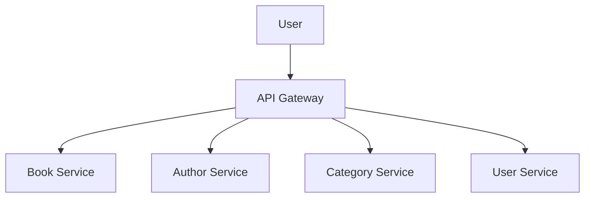
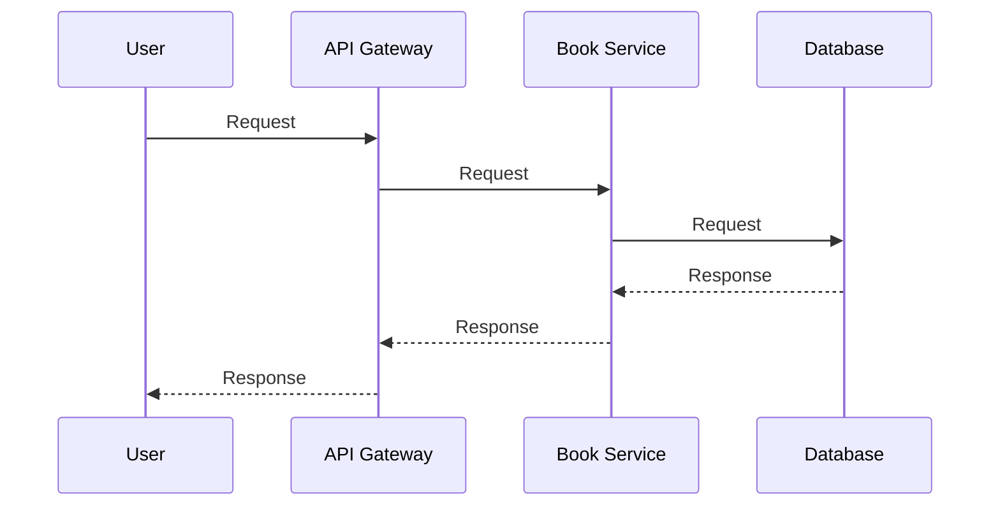
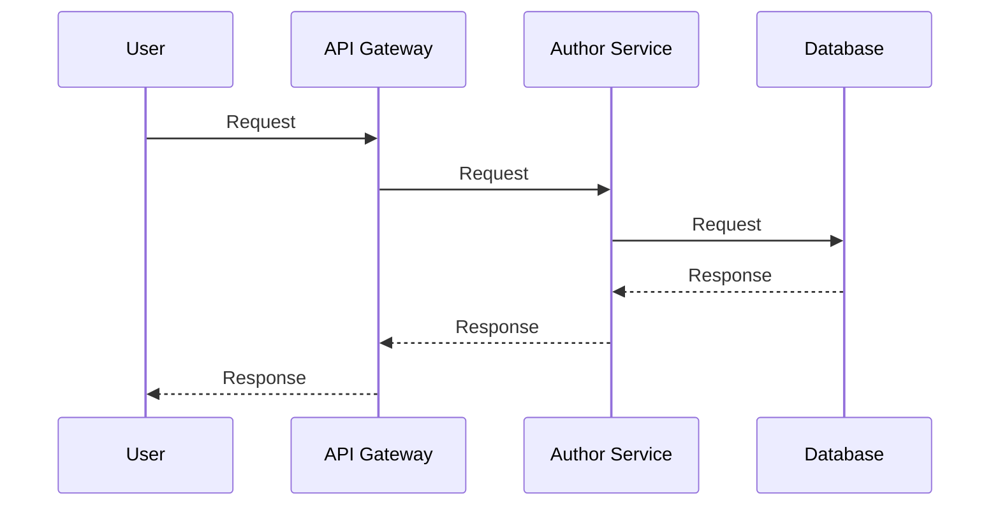
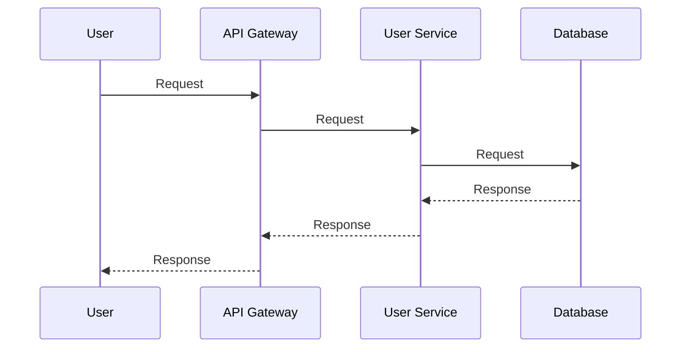

# Library Management System
Library books management system using GRPC and Golang with PostgreSQL database and Redis cache.

## Features
- Authorization and authentication user
- Management of books
- Management of authors
- Management of categories
- Management of borrow books
- Recommendation system based on user borrowing history

## Usecase Diagram


## Sequence Diagram Book Service


## Sequence Diagram Author Service


## Sequence Diagram Category Service


## Sequence Diagram User Service


Link Postman:
```
https://bold-trinity-904712.postman.co/workspace/5f93435f-a044-4476-8e9d-d6270c4700fc/overview
```

## How to run
1. Clone this repository
2. Run `docker-compose up -d` to start the PostgreSQL and Redis


